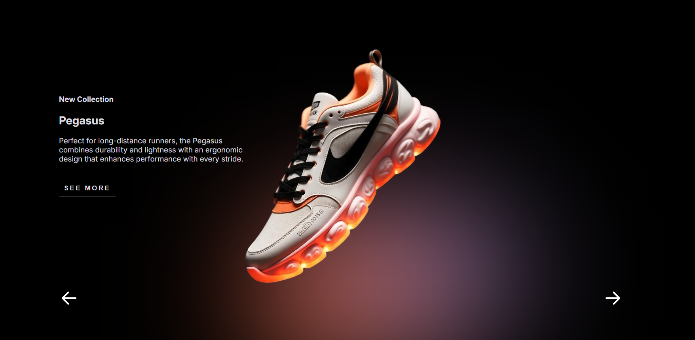

# 🏆 Sneaker Showcase Landing Page

Este es un proyecto de una página de inicio (Landing Page) para mostrar sneakers con un diseño moderno y animaciones atractivas.

## 🚀 Tecnologías utilizadas
- **HTML**: Estructura de la página.
- **CSS**: Estilos y animaciones.
- **JavaScript**: Interactividad, como los botones de navegación y efectos visuales.

## 📌 Características principales
- Diseño elegante y minimalista con fondo oscuro.
- Animaciones sutiles en los elementos para una mejor experiencia de usuario.
- Botón "SEE MORE" para explorar más detalles del producto.
- Controles de navegación en los laterales para cambiar de producto.

## 🎨 Captura de pantalla

## 📂 Estructura del proyecto
